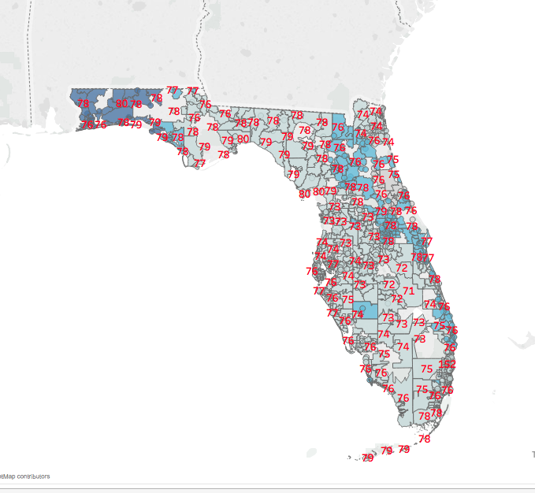

# Data Mining For DNC Voting Campaign


This is a volunteer project for the DNC.  The goal is to gather weather data for the campaign to help them make better decisions about how to allocate get out the vote resources in the days leading up to the election. 

## Data Set

The data is stored:

* `forecasts.csv` (forecasts made on 11/4/2016)
* `forecats_updated.csv` (forecasts made on 11/6/2016)

The data is organized by zip codes in the state of Florida.  Each row has the zip, temperature in Fahrenheit and weather condition for the following days: 11/5, 11/6, 11/7, and 11/8.  Each day is further broken down into predictions at 9am, 12pm, 3pm, 6pm.

## Data Visualization

Below is a visualization of the data.  This is a weather production visualization for all zip codes in florida.  The red numbers are the temperature in that zip code.  The colors represent weather condition.  The darker the blue color, the more likely it is to rain.



## Running The Code

To run the data scraper,  you will need to have an api key from [weather underground](https://www.wunderground.com/weather/api/).  Then api key must be set in an environment variable called `WEATHER_UNDERGROUND_KEY`.

Next, install the dependencies for the nodejs app:

```sh
npm install
```

When the install is finished, run the code:


```sh
node weatherData.js
```

__NOTE__ The data downloader has dates hard coded into it.  If you would like to get your own data set, you will need to update the `desiredDays` array in the `getDaysForZip` function to be any upcoming day in the next 10 days.